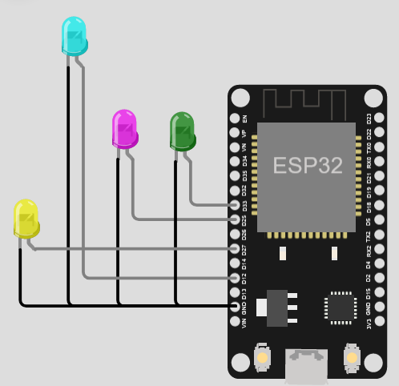
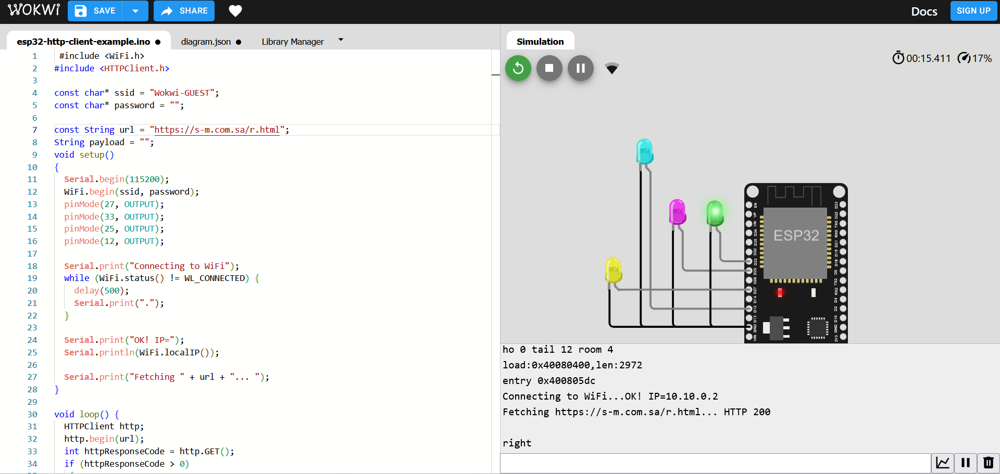
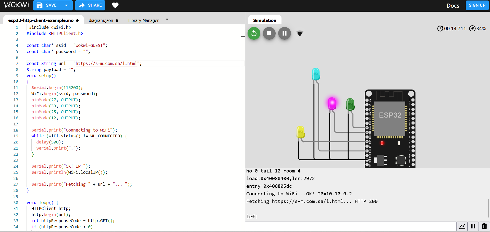
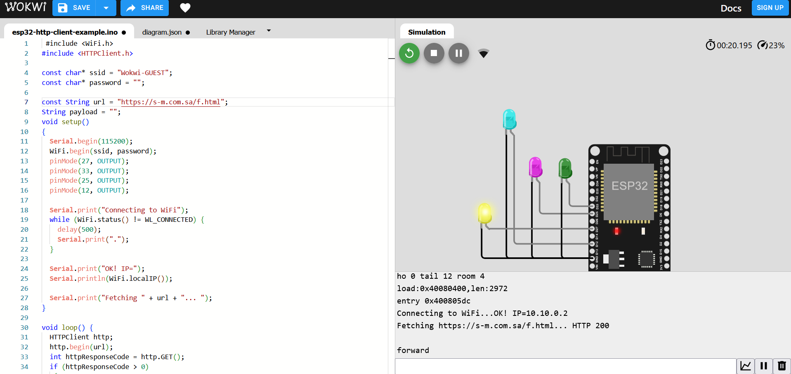
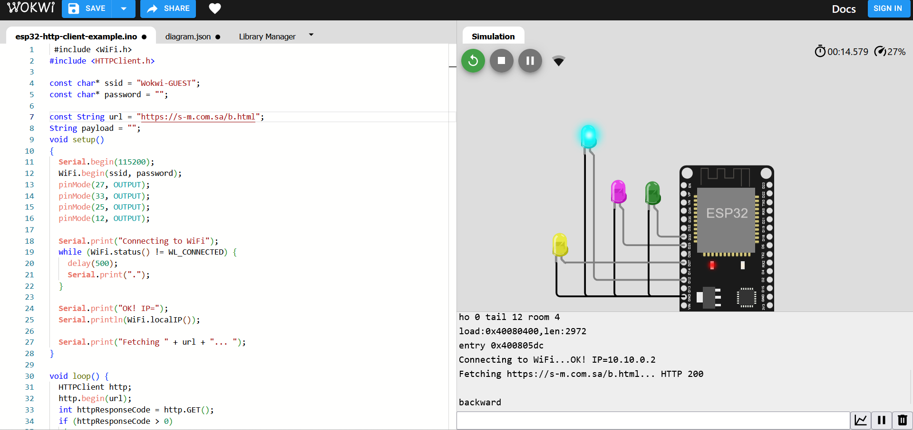

# LEDs-Webpage 🤖
**I have prepared a circuit consisting of 4 LEDs, each of which lights up when the desired direction is set for that port connected to the LED👩‍💻** Linked to a web page

**When I put the right link the LED connected to port 33 lights up**

**When I put the left link the LED connected to port 25 lights up**

**When I put the forward link the LED connected to port 27 lights up**

**When I put the backward link the LED connected to port 12 lights up**

**When I put the stop link, none of the LED lights up because it is in stop mode 👍**

### you can also find the code loaded in files

